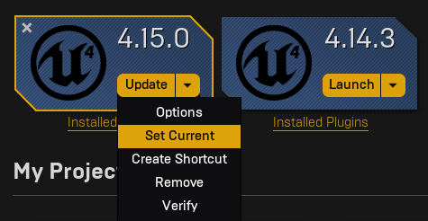
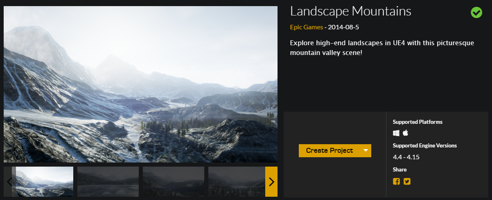
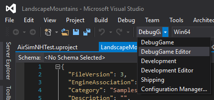
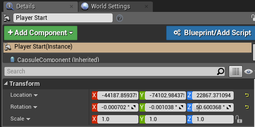
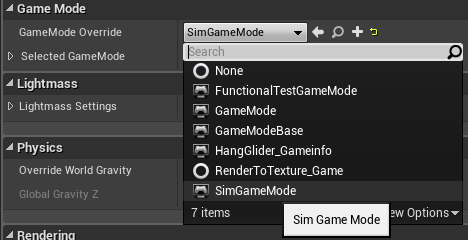

# Unreal 4.15 Windows Demo 

This page contains the complete instructions start to finish for setting up a free downloadable unreal environment
with AirSim.  This document goes with the [Unreal AirSim Setup Video](https://youtu.be/1oY8Qu5maQQ).

First, make sure Unreal 4.15 is installed as per [build instructions](build.md) then make sure the 4.15 version 
is set as the `current` version in the Epic Games Launcher, like this:



Next from the `Epic Games Launcher` click the Learn tab then scroll down and find `Landscape Mountains`.

Click `Create Project` and download this content.  It is about 2 gigabytes.



Now open `LandscapeMountains.uproject`, it should launch the Unreal Editor.


Now from the `File menu` select `New C++ class`, leave default `None` on the type of class, click `Next`, leave default name `MyClass`, and click `Create Class`.

This turns the Landscape Mountains content only project into a C++ project (which we need so we can add the AirSim plugin).

It should compile that new C++ code and then it will open the resulting Visual Studio solution `LandscapeMountains.sln`.

Having followed the AirSim [build instructions](build.md) you should have run `build.cmd` so you can add the following script, 
let's call it `update_airsim.cmd` to your Landscape Mountains project, be sure to fix the `AIRSIM` environment variable so it points to 
the location of your AirSim git repo that you built already.

````
pushd %~dp0
set AIRSIM=D:\git\AirSim
if NOT exist %AIRSIM%\Unreal\Plugins\AirSim goto :nobits
if not exist Plugins\AirSim mkdir Plugins\AirSim
robocopy /MIR %AIRSIM%\Unreal\Plugins\AirSim Plugins\AirSim 
goto :end
:nobits
echo Could not find %AIRSIM%\AirSim\Unreal\Plugins\AirSim
echo Please run build.cmd in the AirSim directory.
:end
popd
pause
````

Now run this script and make sure it succeeded.  You should now see a `~\Plugins\AirSim` folder in your landscape mountains project folder.

Now edit the `LandscapeMountains.uproject` so that it looks like this

````
{
	"FileVersion": 3,
	"EngineAssociation": "4.15",
	"Category": "Samples",
	"Description": "",
	"Modules": [
		{
			"Name": "LandscapeMountains",
			"Type": "Runtime",
			"LoadingPhase": "Default",
			"AdditionalDependencies": [
				"AirSim"
			]
		}
	],
	"TargetPlatforms": [
		"MacNoEditor",
		"WindowsNoEditor"
	],
	"EpicSampleNameHash": "1226740271",
	"Plugins": [
		{
			"Name": "AirSim",
			"Enabled": true
		}
	]
}
````

Close Visual Studio and the  `Unreal Editor` and right click the LandscapeMountains.uproject in Windows Explorer
and select `Generate Visual Studio Project Files`.  This will pick up and incorporate the new plugin we just copied.


If the `Generate Visual Studio Project Files` option is missing you may need to reboot your Windows machine
for the Unreal Shell extension to get loaded.  If it is still missing then open the LandscapeMountains.uproject in the
Unreal Editor and select `Refresh Visual Studio Project` from the `File` menu.

Reopen `LandscapeMountains.sln` in Visual Studio, and make sure "DebugGame Editor" and "Win64" build configuration is the active build configuration.



Select `Rebuild Solution` from the `Build` menu.

Now plug in your `Pixhawk hardware` that that has been configured using QGroundControl to run in `HIL mode` by selecting `HIL Quadrocopter-X` from the AirFrames.
See [px4.md](px4.md) or [sitl.md](sitl.md) for PX4 instructions.

Press `F5` to `run`.   This will run the Visual Studio debugger, and it you should see the `Unreal Editor` loading.  The unreal game is not running yet.
This is a handy mode that lets you edit the game content in the Unreal Editor and debug the game using Visual Studio debugger.

Make sure your ~/Documents/AirSim/settings.json looks like this
````
{
  "LocalHostIp": "127.0.0.1",
  "Pixhawk": {
    "LogViewerHostIp": "127.0.0.1",
    "LogViewerPort": 14388,
    "OffboardCompID": 1,
    "OffboardSysID": 134,
    "QgcHostIp": "127.0.0.1",
    "QgcPort": 14550,
    "SerialBaudRate": 115200,
    "SerialPort": "*",
    "SimCompID": 42,
    "SimSysID": 142,
    "SitlIp": "127.0.0.1",
    "SitlPort": 14556,
    "UdpIp": "127.0.0.1",
    "UdpPort": 14560,
    "UseSerial": true,
    "VehicleCompID": 1,
    "VehicleSysID": 135
  }
}
````

Now find the `PlayerStart` object in the `World Outliner` and set the location to this:



and delete Player Start_2 through 13.

Then using `Window/World Settings`, set the `GameMode Override` to `SimGameMode`:



Now be sure to `Save` these edits, then hit the Play button in the Unreal Editor.

If your RC radio is hooked up you should beable to flying. 
Note: the PX4 allows you to `arm` the drone for take off by holding  the sticks down and to the center.

Note: that Unreal steals the mouse, and we don't draw one.  So to get your mouse back just use Alt+TAB to switch to a different window.

If something doesn't work, please first check the [FAQ](faq.md) then if you don't find the answer there,
turn on C++ exceptions from the Exceptions window:


and copy the stack trace of all exceptions you see there during execution that look relevant (for example, there might be an initial 
exception from VSPerf140 that you can ignore) then paste these call stacks into a new AirSim github issue, thanks.


# Generalized Instructions

So to sum up, to run the AirSim, you need an environment and its very easy to create one! [Unreal Marketplace](https://www.unrealengine.com/marketplace) has dozens of prebuilt extra-ordinarily detailed [environments](https://www.unrealengine.com/marketplace/content-cat/assets/environments) ranging from Moon to Mars and everything in between. The one we have used for testing is called [Modular Neighborhood Pack](https://www.unrealengine.com/marketplace/modular-neighborhood-pack) 
but you can use any environment.
  1. Either purchase an environment from Unreal Marketplace or choose one of the free ones such as [Infinity Blade series](https://www.unrealengine.com/marketplace/infinity-blade-plain-lands). 
  or the [Landscape Mountains](https://www.unrealengine.com/blog/new-on-marketplace-landscape-mountains).
  Alternatively, if you look under the Learn tab in Epic Game Launcher, you will find many free samples that you can use. One of our favorites is "A Boy and His Kite" which is a 100 square miles of highly detailed environment (caution: you will need *very* beefy PC to run it!).
  2. Once you have the environment, you can simply go to the Library tab of the Epic Game Launcher and add in to any project you like. We recommend creating a new blank C++ project with no Starter Content and add your environment in to it.
  3. If the environment comes with MatineeActor, delete it to avoid any startup demo sequences. There might be other ways to remove it as well, for example, click on Blueprints button, then Level Blueprint and then look at Begin Play event in Event Graph. You might want to disconnect any connections that may be starting "matinee".
  4. You might have to set default map for your project. For example, if you are using Modular Neighborhood Pack, set the Editor Starter Map as well as Game Default Map to Demo_Map in Project Settings > Maps & Modes..

## Install the AirSim Plugin
### Copy plugins folder
  Copy the `Unreal\Plugins` folder from the build you did in the above section into the root of your Unreal project's folder. The overall structure should look something like this: 

### Enable plugin for your Unreal project

In your Unreal project's .uproject file, add the key `AdditionalDependencies` to the "Modules" object
as we showed in the `LandscapeMountains.uproject` above.
   ```
"AdditionalDependencies": [
    "AirSim"
]
   ```                
and the `Plugins` section to the top level object:
   ```
        "Plugins": [
            {
                "Name": "AirSim",
                "Enabled": true
            }
        ]      
  ```

### Ready, Set, Go!
You are all ready to go now! 

1. Right click on the Unreal project .uproject file, then Generate Visual Studio Project files. 
2. Double click on .sln file to open the solution. 
3. Hit F5.
4. After Unreal Editor comes up, go to the World settings and select Game Mode = SimGameMode.
5. Make sure your environment has a Player Start component or add one. This is where the quadrotor will be placed.
6. Hit Play button.

Congratulations! You are now running AirSim in your own Unreal environment.

